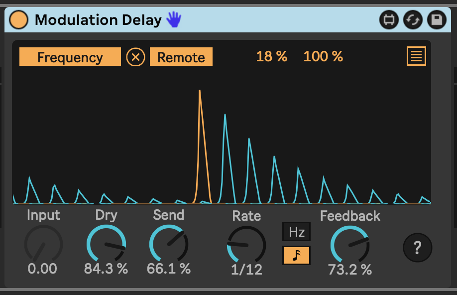

# Automation Delay

Take what you know about audio delays and apply it to automation signals! Automation Delay is a Max For Live device that can affect an automation signal in the same way a feedbacking delay effect can turn sound into echoes.

Send automation data to its Input, map up to eight automation destinations, and play with the controls to get interesting to wild results.

* *Dry* - The level of the dry (input) automation signal in the final output.
* *Send* - The level of the input signal to send to the delay circuit.
* *Delay* - The delay time.
* *Feedback* - The amount of the output signal to mix into the input.

Here is an image of a Shaper device sending a signal to AutomationDelay, where it creates echoes of the input.

The device plots the input signal in grey, the delay signal in light blue, the feedback signal in dark blue, and the output signal in orange.

## Installation

[Download the newest .amxd file from the frozen/ directory](https://github.com/zsteinkamp/m4l-zs-AutomationDelay/tree/main/frozen/) or clone this repository, and drag the `AutomationDelay.amxd` device into a track in Ableton Live.

## Changelog

* 2022-11-30 [0.0.2](https://github.com/zsteinkamp/m4l-zs-AutomationDelay/raw/main/frozen/AutomationDelay-0.0.2.amxd) - Added tempo sync option.
* 2022-11-29 [0.0.1](https://github.com/zsteinkamp/m4l-zs-AutomationDelay/raw/main/frozen/AutomationDelay-0.0.1.amxd) - Initial release.

## TODO

* ...

## Contributing

I'd love it if others extended this device. If you would like to contribute, simply fork this repo, make your changes, and open a pull request and I'll have a look.
